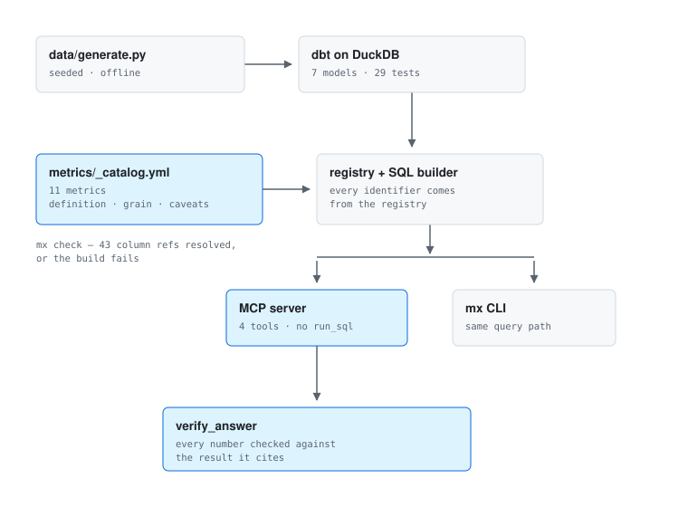

# metrics-mcp

[](https://github.com/razornne/metrics-mcp/actions/workflows/ci.yml)
[](https://www.python.org/downloads/)
[](LICENSE)

A semantic layer an agent has to go through, and a check that it did.

Metrics are defined once, in YAML. The SQL comes from dbt. An agent asking a
question over MCP cannot write its own query and cannot invent its own
definition of "active account" — and every number it puts in a sentence is
verified against the result it came from before that sentence is allowed out.

```bash
uv sync --extra dev
uv run mx build          # generates the dataset, builds the dbt warehouse
uv run mx query MX-001   # or: uv run mx serve, for the MCP server
```

No key and no network for any of that. The dataset is generated from a fixed
seed, the warehouse is a DuckDB file, and the whole CI run — build, tests,
eval — happens offline.

```
MX-001 - Active accounts  count
┌─────────┬───────┐
│ month   │ value │
├─────────┼───────┤
│ 2026-06 │ 168   │
│ 2026-07 │ 176   │
│ 2026-08 │ 186   │
│ 2026-09 │ 185   │
└─────────┴───────┘
2026-09 is incomplete - not comparable with the months before it.
```

That last line is the shape of the whole repo: the thing most likely to be
misread is said out loud, by the layer that knows, rather than left for the
reader to notice.

---

## Why

Point an agent at a warehouse with a SQL tool and it will answer every
question you ask. Some of those answers will be wrong in a way nobody catches,
because the two failures that matter do not look like failures:

- **It writes its own definition.** Asked for active accounts twice in one
  conversation, it can produce two different numbers — one counting any event,
  one counting meaningful ones — and both look right.
- **It states a number that is not in the data.** A figure near the real one
  is indistinguishable from the real one at a glance, and it only has to happen
  once for the whole surface to stop being trusted.

This repo closes both, structurally rather than by asking nicely in a prompt.

## Results

20 questions, 15 of which have an answer in the registry and 5 of which do not
(`evals/cases.yaml`). Three things are measured separately, because they fail
for different reasons.

| | keyword baseline | `claude-sonnet-5` |
|---|---|---|
| routing — right metric chosen | 40.0% | **68.4%** |
| refusal — declined the 5 unanswerable | 80.0% | **100.0%** |
| false refusal — declined an answerable one | 40.0% | 31.7% |
| grounding — every stated number verified | 100.0% | **100.0%** |

The model column is the mean of four runs. Routing ranged 60.0–80.0% across
them and false refusal 20.0–40.0%, which is itself worth saying: a single eval
run is not a measurement. Refusal and grounding were 100% in every run.

### The guard has to be watched failing

Grounding at 100% means nothing on its own — a check that always passes scores
100% too. So two stubs deliberately answer wrongly, in the two different ways
an answer can be wrong, and the check is scored on catching them.

| stub, and how it lies | membership check | scoped to the named month |
|---|---|---|
| **hallucinator** — a number that is nowhere in the data | **100% caught** | **100% caught** |
| **misattributor** — a real number, from the wrong month | **0% caught** | **90% caught** |

That table is the argument for scoping. An invented number is easy: it is
absent from the result and any check finds it. A real number attached to the
wrong month passes a membership check *every single time*, and nothing about
the sentence looks invented to a reader either.

The residual 10% is months that happen to share a value, where naming the wrong
one is undetectable by this method — a property of the data, not a bug with a
fix. Both numbers are gated in CI: if an invented number ever survives, or if
misattribution catching drops below 90%, the eval exits non-zero.

**What the model's errors actually were.** Every one of them was a false
refusal — declining a question it could have answered, never answering the
wrong one. Across four runs it picked a wrong metric zero times. That is the
failure you want: a system that says "no metric covers that" is recoverable,
one that confidently reports the wrong quantity is not.

**The baseline is there to make the other columns mean something.** It is word
overlap against the label and definition, refusing below two matching words. It
gets 40% because "MAU" does not appear in the phrase "Monthly active users" and
nothing about word counting fixes that.

## The three rules

**A metric is defined once.** `metrics/_catalog.yml` holds the definition, the
grain, the model, the columns and the caveats. Nothing downstream — not the
CLI, not the MCP server, not the eval — carries a second copy. When two honest
definitions of "active" exist, the registry names both (`MX-001` counts any
event, `MX-011` counts meaningful ones) so a conversation can say which it
means, rather than one quietly winning.

**A ratio is a pair of columns, never a stored rate.** `sum(numerator) /
sum(denominator)` survives aggregation; `avg(rate)` does not, and it is the one
people reach for. Storing activation as a per-account rate would give an
account with one user the same weight as one with forty, and the number would
stop being what its name says while still looking fine. The registry cannot
express a ratio any other way, and a test asserts the two roll-ups disagree —
so the reason the rule exists is demonstrated, not asserted.

```
│ month   │ plan       │ value  │ numerator │ denominator │
│ 2026-08 │ enterprise │ 0.6667 │ 2.0       │ 3.0         │
│ 2026-08 │ free       │ 0.0741 │ 2.0       │ 27.0        │
│ 2026-08 │ pro        │ 0.5    │ 8.0       │ 16.0        │
```

The components come back with the value, so a wider period can be rolled up
correctly by whoever needs one.

**The registry is checked against the warehouse, not trusted.** `mx check`
resolves every model and every column reference — 43 of them — and fails if one
is missing. A renamed column breaks CI instead of silently returning a wrong
number to whoever asks next.

```
OK 11 metrics resolve against the warehouse (43 column references checked)
```

## What the agent can and cannot do

Four tools, and the absence of a fifth is the design:

| tool | |
|---|---|
| `list_metrics` | what exists |
| `get_metric` | what one means, **caveats included** |
| `query_metric` | the numbers, plus the SQL that produced them |
| `verify_answer` | whether a sentence is allowed to be sent |

There is no `run_sql`. A test asserts the exposed tool set is exactly these
four, so adding one is a deliberate act with a red build attached.

The agent supplies a metric id, a period, and at most one dimension from that
metric's allow-list. Every identifier reaching SQL comes from the registry
file, which has itself been resolved against the warehouse. A cut that is not
on the list is refused rather than approximated:

```json
{"error": "MX-001 cannot be cut by 'account_id'. Allowed: plan, country."}
```

## Verification

`verify_answer` pulls every numeral out of the prose and asks whether each one
is in the result. Two details do most of the work:

**A claim that names a month is checked against that month.** Membership in the
result as a whole is not enough — it accepts a real number attached to the
wrong period every time (measured above: 0% caught by membership, 90% once
scoped). That is the error that survives review, because nothing about the
sentence looks invented.

**Percentages and rounding are handled where they are ambiguous, and nowhere
else.** A stored `0.238` may be written `23.8%`; a printed `12.3` may stand for
a stored `12.34`. Comparison happens at the precision the text used, so `12.5`
is still rejected.

It does not check meaning. "Activation fell" next to a correct, rising number
will pass. This narrows failure to the numeric kind — the kind that destroys
trust fastest, and the only kind a machine can settle on its own.

### A bug worth keeping in the README

The first version of the number regex ended with `(?![\d.])`, to stop it
matching inside a longer number. It also stopped it matching a number followed
by a full stop — which is to say, the last number in almost every sentence
anyone writes. The verifier reported "no numbers found", concluded there was
nothing to disprove, and passed everything.

Nothing failed. The tests were green, because they happened to use numbers
mid-sentence. The eval found it: the hallucinator was being caught 60% of the
time instead of 100%, and there was no reason for the gap. A guard that
silently stops guarding looks exactly like a guard that is working, and the
only thing that tells them apart is a case you expect to fail. That is why the
stubs are in CI.

## Architecture

<picture>
  <source media="(prefers-color-scheme: dark)" srcset="docs/architecture-dark.svg">
  
</picture>

<sub>Both themes are generated from one definition by
<code>docs/make_diagram.py</code> — two hand-drawn files drift.</sub>

The CLI and the MCP server share the query builder, so what a reviewer sees on
the command line is what an agent gets.

**The warehouse** is 7 models over 4 sources, with 29 dbt tests. Staging cleans
exactly two things — exact duplicate events, and timestamps from client clocks
set in the future — and the tests are the contract: remove the dedupe and
uniqueness fails; remove the clock filter and the range test fails. A further
test asserts the raw data still *contains* both defects, so the two guards
cannot pass by having nothing to catch.

Nothing is repaired further up. A metric should not have to know its source
needs cleaning.

## Adding a metric

```yaml
- id: MX-012
  label: Weekly contributing accounts
  definition: Accounts that took a terminal action in the week.
  grain: month
  unit: count
  model: fct_account_month
  type: count_distinct
  measure: account_id
  filter: n_terminal_events > 0
  dimensions: [plan, country]
  owner: product
  status: active
  caveats: Terminal actions only - a view is not a contribution.
```

That is the whole change. `mx check` resolves it on the next run; if
`n_terminal_events` is not on `fct_account_month`, CI says so by name.

`filter` accepts a bare column or a column compared to a number, and nothing
else. It is written into SQL, so its grammar is the security boundary — there
are tests for `1=1 or true`, a trailing `; drop table`, and a subquery.

## Where it is weak

- **The dataset is synthetic.** Deliberately, so CI needs no download and no
  credential, and so a test can assert on exact numbers. It is not a real
  product's traffic and no conclusion about user behaviour should be drawn
  from it. The subject here is the contract between registry, warehouse and
  agent.
- **Routing is the weakest link, at 68%.** All of its errors are false
  refusals, which is the safe direction, but a metric whose label does not
  contain the asker's word ("MAU") gets missed. Synonyms in the registry would
  likely fix most of it and are not implemented.
- **One dimension at a time.** Cutting by plan *and* country is not supported.
- **Month grain only.** The spine, the facts and the tools all assume it.
- **`verify_answer` holds results in memory**, so a `result_id` does not
  survive a restart.
- **Four eval runs** is enough to see variance, not to bound it.
- **Grounding is checked per claim, not per paragraph.** A sentence naming two
  months is checked against both, so a number correct for either passes.

## Layout

```
data/generate.py          seeded synthetic product usage
warehouse/                dbt project on DuckDB - 7 models, 29 tests
metrics/_catalog.yml      the registry: 11 metrics
src/metrics_mcp/
  registry.py             load, validate, resolve against the warehouse
  warehouse.py            registry entry -> SQL -> result
  verify.py               the number check
  server.py               MCP: 4 tools
  cli.py                  mx build | check | list | query | serve
evals/                    20 cases, 4 drivers
tests/                    55 tests, offline
```

## Running it

```bash
uv sync --extra dev
uv run mx build                    # generate + dbt build
uv run mx check                    # registry resolves against the warehouse
uv run mx list                     # the registry
uv run mx query MX-007 --by plan --sql
uv run mx serve                    # MCP over stdio
```

```bash
uv run pytest -q                                       # 55 tests, no key
uv run python evals/run_eval.py --llm keyword --compare hallucinator --compare misattributor
uv run python evals/run_eval.py --llm misattributor --check membership   # the gap
uv run python evals/run_eval.py --llm anthropic --compare keyword        # needs a key
```

To point a client at it, run `mx serve` and register the process as an MCP
server over stdio.

## Why this exists

It is the pattern I run in production at a proptech SaaS — a registry of 155
metrics across four dashboard domains, a 124-model dbt project, and an LLM
commentary layer whose numbers are checked against the fact set before they
ship — rebuilt small, on open ground, so the parts can be read. That code is
not mine to publish. This is.
